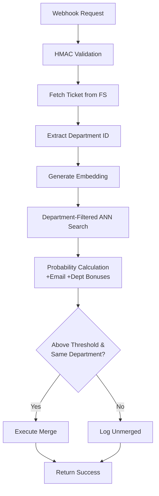
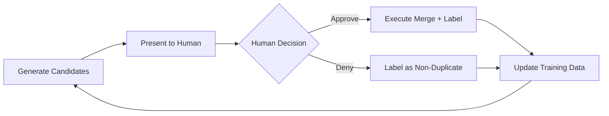
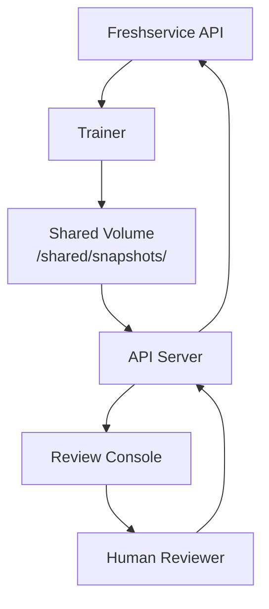

# System Architecture & Component Responsibilities

This document defines the **three main components** that comprise the **Semantic-Ticket-Search** system. Each component has distinct responsibilities, deployment patterns, and security boundaries.

---

## 🏗️ Component Overview

| Component | Container | Runtime | Access Pattern | Primary Function |
|-----------|-----------|---------|----------------|------------------|
| **Trainer** | `semantic-ticket-trainer` | Batch (cron/CI) | **Write** snapshots, **Read/Write** Freshservice | Build department-aware similarity index from historical tickets |
| **API Server** | `semantic-ticket-api` | Always-on daemon | **Read** snapshots, **Read/Write** Freshservice | Real-time duplicate detection & merging within departments |
| **Review Console** | `streamlit` or embedded | On-demand | **Read** via API Server | Human-in-the-loop validation & active learning with department isolation |

---

## 🚂 Trainer Component

### **Primary Responsibility**
Generate immutable, timestamped snapshots containing FAISS similarity indexes and ticket metadata for consumption by the API Server.

### **Operational Workflow**
1. **Configuration Validation**: Verify required environment variables (`FS_DOMAIN`, `FS_API_KEY`, `GROUP_IDS`)
2. **Incremental Data Harvest**: Fetch tickets from last `DAYS_BACK` days via Freshservice API
3. **Department Extraction**: Extract and store `department_id` from each ticket for isolation boundaries
4. **Smart Embedding**: Generate embeddings only for new/unseen tickets (reuse existing embeddings)
5. **Index Construction**: Build FAISS Inner Product index with L2-normalized vectors
6. **Department-Aware Metadata**: Include department information in snapshot metadata
7. **Atomic Snapshot Creation**: Write immutable snapshot with timestamped directory structure
8. **Symlink Management**: Update `current` symlink atomically for zero-downtime deployments

### **Snapshot Architecture**
```
/shared/snapshots/
├── 2024-06-01T12-00-00Z/
│   ├── vectors.faiss     # Binary FAISS index (float32)
│   └── meta.json         # Ticket metadata + configuration
├── 2024-06-01T18-30-15Z/
│   ├── vectors.faiss     # Newer snapshot
│   └── meta.json         # Updated metadata
└── ../current → 2024-06-01T18-30-15Z/  # Atomic symlink
```

### **Exit Codes & Error Handling**
| Exit Code | Scenario | Recovery Action |
|-----------|----------|-----------------|
| `0` | Success | Continue normal operations |
| `1` | Configuration error | Fix environment variables |
| `2` | Freshservice API failure | Check API key & network |
| `3` | Snapshot write failure | Verify volume permissions |

### **Security Model**
- **API Key Security**: Never logged or exposed in stdout
- **Volume Access**: Write-only to shared volume, no read dependencies on API Server
- **Isolation**: Runs in separate container with minimal attack surface

---

## 🌐 API Server Component

### **Primary Responsibility** 
Provide low-latency HTTP endpoints for real-time duplicate detection, manual review workflows, and system management.

### **Startup Sequence**
1. **Snapshot Discovery**: Wait for valid snapshot in `/shared/current/`
2. **Model Loading**: Initialize SentenceTransformer based on snapshot metadata
3. **Memory Mapping**: Load FAISS index into memory for fast queries
4. **Thread Pool**: Pre-warm worker threads for concurrent request handling

### **Core Endpoints**

#### **Production Endpoints**
| Route | Method | Authentication | Purpose |
|-------|--------|----------------|---------|
| `/webhook` | POST | HMAC-SHA256 (optional) | Real-time duplicate detection & auto-merge |
| `/healthz` | GET | None | Kubernetes readiness/liveness probe |
| `/metrics` | GET | None | Prometheus metrics exposition |

#### **Management Endpoints**
| Route | Method | Authentication | Purpose |
|-------|--------|----------------|---------|
| `/reloadIndex` | POST | `X-Reload-Token` header | Hot-reload new snapshots |

#### **Review & Active Learning Endpoints**
| Route | Method | Authentication | Purpose |
|-------|--------|----------------|---------|
| `/review` | GET | None | Human review UI (HTML) |
| `/candidates` | GET | None | Potential duplicate pairs (JSON) |
| `/label` | POST | None | Submit human feedback for active learning |

### **Request Processing Pipeline**


### **Concurrency & Performance**
- **Thread Pool**: All I/O operations (FS API, embedding, merge) run in thread pool
- **Memory Efficiency**: FAISS index memory-mapped for fast access
- **Cache Strategy**: LRU caches for embedder and analyzer instances
- **Hot Reload**: <200ms reload time with zero request failures

### **Failure Modes & Resilience**
| Failure Scenario | Detection | Mitigation |
|------------------|-----------|------------|
| Snapshot corruption | 503 errors on `/healthz` | Automatic rollback to previous snapshot |
| Memory exhaustion | Container metrics | Kubernetes resource limits & restart |
| API rate limiting | HTTP 429 responses | Exponential backoff with jitter |
| FAISS index corruption | Search exceptions | Graceful degradation to exact similarity |

---

## 🕵️ Review Console Component

### **Primary Responsibility**
Provide human-in-the-loop validation for edge cases and continuous improvement through active learning feedback.

### **Architecture Patterns**

#### **Embedded Mode** (Default)
- Integrated directly into API Server as `/review` endpoint
- Lightweight Alpine.js + TailwindCSS frontend
- No additional deployment complexity

#### **Standalone Mode** (Advanced)
- Separate Streamlit application (`src/review_console.py`)
- Rich UI with session management and batch operations
- Ideal for dedicated review teams

### **Core Workflows**

#### **Candidate Generation**
1. Query tickets within configurable date range (`REVIEW_DAYS_BACK`)
2. Filter by similarity thresholds (`REVIEW_SIM_LOWER` to `REVIEW_SIM_UPPER`)
3. **Apply department isolation** - only consider pairs from the same department
4. Exclude already-labeled pairs from current session
5. Rank by duplicate probability (highest confidence first)

#### **Human Feedback Loop**


#### **Session Management**
- **Persistence**: Track processed pairs within browser session
- **Deduplication**: Avoid showing same pair twice in one session
- **Progress Tracking**: Visual feedback on review completion

### **Configuration Parameters**
| Variable | Purpose | Default |
|----------|---------|---------|
| `REVIEW_USER` | Attribution for human labels | `anonymous` |
| `REVIEW_SIM_LOWER` | Minimum similarity for candidates | `0.65` |
| `REVIEW_SIM_UPPER` | Maximum similarity (below auto-merge) | `0.90` |
| `REVIEW_MAX` | Maximum candidates per session | `100` |
| `REVIEW_DAYS_BACK` | Historical window for ticket selection | `60` |

---

## 🔄 Inter-Component Communication

### **Data Flow Architecture**


### **Shared Volume Contract**
The **only** direct integration between components is the shared volume:

```
/shared/
├── snapshots/           # Immutable timestamped directories
│   └── YYYY-MM-DDTHH-MM-SSZ/
│       ├── vectors.faiss    # FAISS binary index
│       └── meta.json        # Metadata + configuration
└── current → snapshots/...  # Atomic symlink
```

### **Metadata Schema** (`meta.json`)
```json
{
  "tickets": [                   // Serialized ticket objects with department info
    {
      "id": "123",
      "title": "Sample ticket",
      "description": "Description text",
      "department_id": "dept_001",  // Department isolation boundary
      "requester_email": "user@example.com",
      "created_at": "2024-06-01T12:00:00Z",
      "category": "Hardware",
      "priority": "Medium"
    }
  ],
  "similarity_threshold": 0.85,  // Auto-merge threshold
  "updated_at": "2024-06-01...", // ISO timestamp
  "model": "all-MiniLM-L6-v2",   // Embedding model name
  "dim": 384,                    // Vector dimension
  "schema_version": "1.0"        // Future compatibility
}
```

---

## 🏢 Department Isolation Architecture

### **Department-Aware Processing**
All three components implement **automatic department boundary enforcement** to ensure data privacy and relevance:

#### **Data Extraction & Storage**
- **Trainer**: Extracts `department_id` from Freshservice API (`department_id` field)
- **Snapshot Format**: Includes department information in ticket metadata
- **Backward Compatibility**: Gracefully handles tickets without department IDs

#### **Similarity Filtering**
- **Query Filtering**: `find_similar_tickets()` only considers tickets within the same department
- **Cross-Department Isolation**: Tickets from different departments never influence similarity calculations
- **Performance Optimization**: Reduced search space leads to faster processing

#### **Probability Enhancement**
The duplicate probability calculation includes department context:
```
probability = 0.85 × cosine_similarity + 0.10 × email_bonus + 0.05 × department_bonus
```

#### **Component-Specific Implementation**
| Component | Department Filtering Mechanism |
|-----------|-------------------------------|
| **Trainer** | Stores department metadata in snapshots; builds department-aware indexes |
| **API Server** | Filters ANN search results by department; prevents cross-department merges |
| **Review Console** | Generates candidates only from same department; UI shows department context |

### **Privacy & Security Benefits**
- **🔒 Data Isolation**: Complete separation of similarity calculations across departments
- **🎯 Relevance**: More accurate duplicate detection within organizational boundaries
- **⚡ Performance**: Smaller search spaces improve query response times
- **📊 Audit Compliance**: Department boundaries support regulatory requirements

### **Configuration & Deployment**
- **Zero Configuration**: Department filtering is automatic and requires no setup
- **Graceful Degradation**: Tickets without department IDs fall back to global comparison
- **Migration Support**: Existing deployments continue working without changes

---

## 🔒 Security Boundaries

### **Trust Relationships**
- **Trainer → Shared Volume**: Write-only, creates immutable artifacts
- **API Server → Shared Volume**: Read-only, never modifies snapshots
- **API Server → Freshservice**: Read tickets, write merge operations
- **Review Console → API Server**: HTTP API calls, no direct system access

### **Secret Management**
| Component | Secrets Required | Storage Method |
|-----------|------------------|----------------|
| Trainer | `FS_API_KEY` | Environment variable or file mount |
| API Server | `FS_API_KEY`, `WEBHOOK_SECRET`, `RELOAD_TOKEN` | Environment variables |
| Review Console | None (proxies through API Server) | N/A |

### **Network Isolation**
- **Trainer**: Outbound to Freshservice API only
- **API Server**: Inbound HTTP + outbound to Freshservice API
- **Review Console**: Inbound HTTP (if standalone) or embedded

---

## 📈 Scaling & Deployment Patterns

### **Horizontal Scaling**
- **Trainer**: Single instance (cron job pattern)
- **API Server**: Multiple replicas behind load balancer
- **Review Console**: Multiple instances (stateless with session management)

### **Version Compatibility**
- **Backward Compatibility**: API Server supports previous snapshot schema versions
- **Rolling Deployments**: New snapshots activate via symlink flip
- **Rollback Strategy**: Previous snapshots remain available for emergency fallback

### **Monitoring & Observability**
- **Trainer**: Structured logs + exit codes for CI/CD integration
- **API Server**: Prometheus metrics + health checks + request tracing
- **Review Console**: User activity logs + session analytics

---

## 🚀 Future Architecture Evolution

### **Planned Enhancements**
- **Multi-Model Support**: Parallel indexes with different embedding models
- **Department-Specific Models**: Fine-tuned embeddings for each department's domain
- **Distributed Training**: Trainer job splitting across multiple workers
- **Real-Time Updates**: Streaming ticket updates without full retraining
- **Advanced Active Learning**: Uncertainty sampling and query strategies with department context
- **Department Analytics**: Per-department duplicate detection metrics and insights

### **Migration Strategy**
Each architectural change follows a **blue-green deployment** pattern:
1. Deploy new component versions alongside existing
2. Generate new snapshot format while maintaining compatibility
3. Flip traffic to new version via configuration
4. Remove old components after validation period